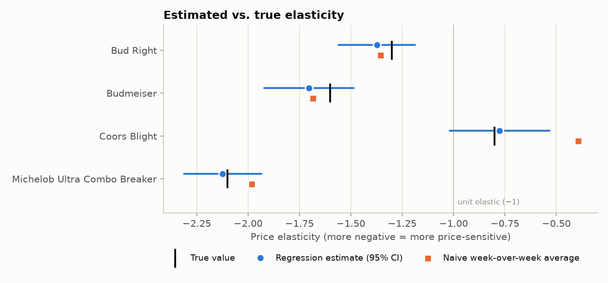
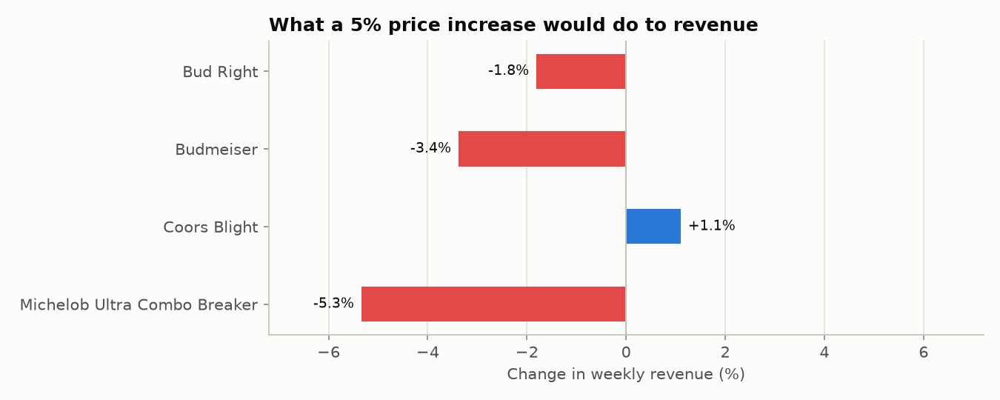
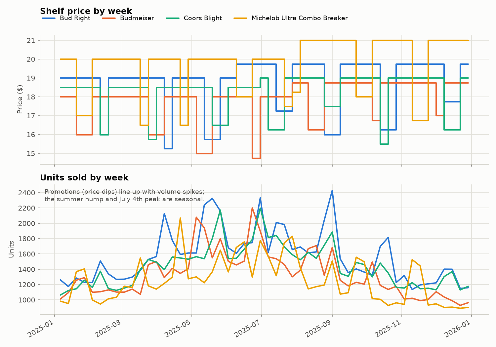
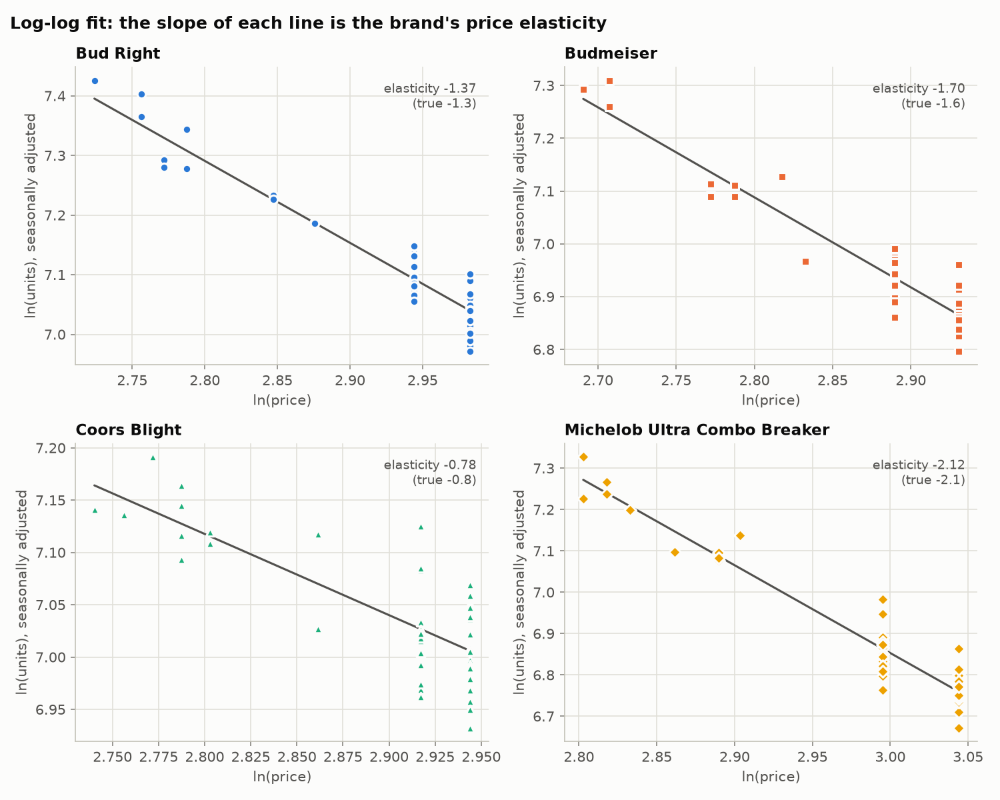

# Retail Price Elasticity Analysis

**Question:** if we raise or cut a beer brand's shelf price, how much does weekly volume move, and would the price change make or lose money?

This project estimates the **price elasticity of demand** for four brands from a year of weekly retail data. It compares a quick spreadsheet-style method against a regression model that controls for seasonality, and turns the results into a revenue recommendation per brand.

> **The data is synthetic.** The brand names are parodies, and the numbers come from `generate_data.py`, which simulates realistic weekly retail behaviour (seasonal demand, holiday spikes, promotions, a mid-year price increase, random noise) using a known "true" elasticity for each brand. That means the analysis can be checked against the right answer, which is impossible with real data.

**[▶ Interactive price simulator](https://samuelosborn88.github.io/Data-Science/)**: pick a brand, move the price slider, and see projected weekly volume and revenue with confidence ranges.

## Key findings

| Brand | Estimated elasticity (95% CI) | True value | Type | Revenue impact of +5% price |
|---|---|---|---|---|
| Bud Right | −1.37 (−1.56 to −1.18) | −1.3 | Elastic | −1.8% |
| Budmeiser | −1.70 (−1.93 to −1.48) | −1.6 | Elastic | −3.4% |
| Coors Blight | −0.78 (−1.02 to −0.53) | −0.8 | Inelastic | **+1.1%** |
| Michelob Ultra Combo Breaker | −2.12 (−2.32 to −1.93) | −2.1 | Elastic | −5.3% |

- **Coors Blight is the only brand where a price increase grows revenue.** Its shoppers are relatively loyal: a 5% increase loses about 4% of volume, but each sale earns more.
- **Michelob Ultra Combo Breaker is the most price-sensitive.** A 5% increase would cost about 10% of volume and 5% of revenue, so it's the best candidate for promotions, since cuts pull in the most extra volume.
- **The regression recovered every true elasticity within its 95% confidence interval.** Its average error was **0.06**, versus **0.17** for the naive method.
- **The naive method got Coors Blight badly wrong** (−0.39 against a true −0.8), which would have *understated* how much volume a price rise loses. Its week-to-week estimates for that brand swung wildly (standard deviation 2.7), because seasonal and holiday swings in volume get blamed on whatever small price change happened that week.





## The data

52 weeks (2025) × 4 brands = 208 rows in `data/retail_price_volume.csv`:

| column | description |
|---|---|
| `week` | week start date (Monday) |
| `brand` | brand name |
| `price` | average shelf price that week ($) |
| `units_sold` | units sold that week |



Promotions (price dips) line up with volume spikes. But volume also rises every summer and around Memorial Day, July 4th and Labor Day regardless of price, and a good model has to separate those two effects.

## Method

**Elasticity** = % change in units sold ÷ % change in price. For example, −1.5 means a 1% price increase loses 1.5% of volume. Beyond −1 (for example −1.5) a brand is *elastic*: raising the price loses revenue. Between 0 and −1 it's *inelastic*: raising the price gains revenue.

**1. Naive week-over-week (the starting point).** For each week where the price moved by at least 1%, divide the % change in units by the % change in price, then average across weeks. It's simple and easy to do in Excel, but it assumes price is the *only* thing that changed from one week to the next.

**2. Log-log regression with week fixed effects (the main model).**

```
ln(units) = brand intercept + week effect + elasticity_brand × ln(price)
```

- Taking logs makes the price coefficient *directly* equal to the elasticity.
- The **week effect** is a separate term for each week, shared by all brands. It soaks up everything that moves every brand's volume together (summer, holidays, weather) so it isn't mistaken for a price effect.
- Each brand gets its own elasticity, estimated from its own promotions and price changes relative to the other brands that week.
- It's fitted as one pooled ordinary least squares model in NumPy, with standard errors and 95% confidence intervals computed from the residuals. Model R² = 0.97.



**3. Revenue scenario.** For a price change of *p*, revenue changes by a factor of (1 + p)^(1 + elasticity). The table above uses *p* = +5%.

## How to run

```bash
cd retail-price-elasticity
pip install -r requirements.txt
python generate_data.py      # optional: recreates data/ from a fixed random seed
python analyze.py            # prints the summary and writes outputs/ and figures/
```

**Outputs:**
- `outputs/elasticity_summary.csv`: one row per brand with both estimates, confidence intervals, true values and revenue impact
- `outputs/weekly_with_elasticity.csv`: the weekly data with week-over-week % changes and naive elasticities
- `figures/`: the four charts above
- `../docs/data.js`: the data for the [interactive dashboard](../docs/index.html), which is regenerated on every run

## Limitations and next steps

- **Cross-price effects:** a promotion on one brand likely steals volume from the others. A next step is adding competitors' prices to each brand's model to measure substitution.
- **Promotion vs. regular price:** shoppers may react differently to a temporary promotion than to a permanent price change. With real data, I'd separate those two effects.
- **Real data:** real scan data would add store-level variation, distribution changes and promotion mechanics (displays, features) that this simulation leaves out.
